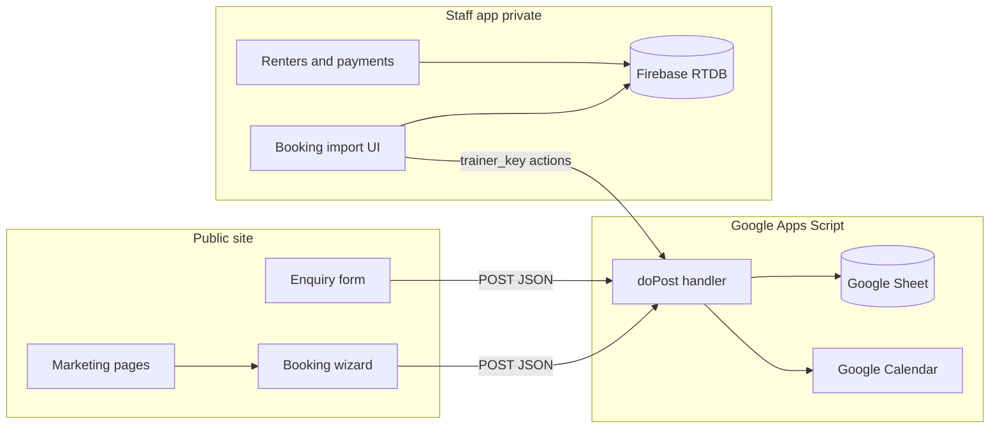
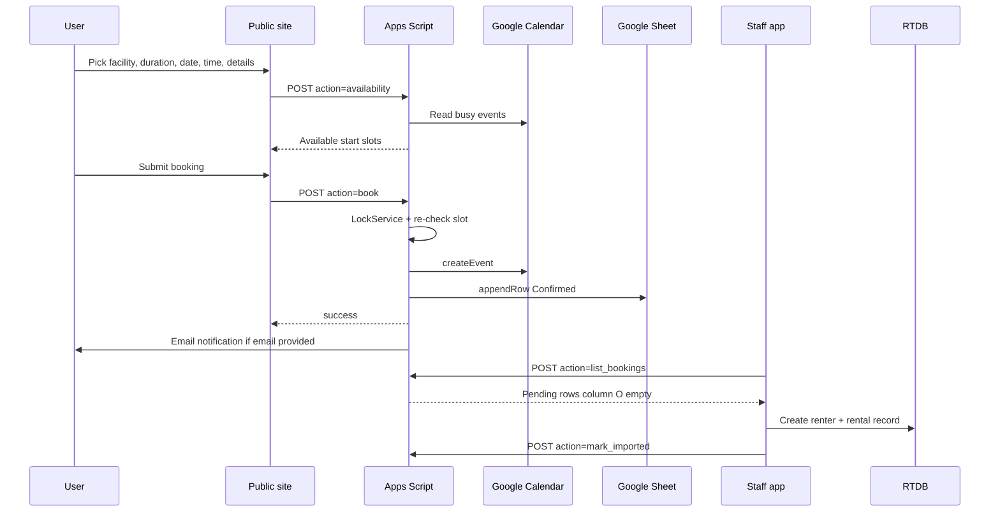
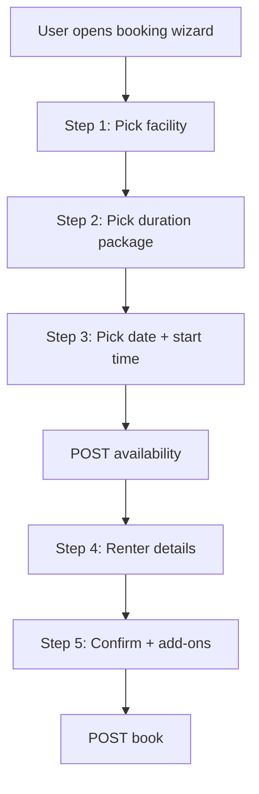
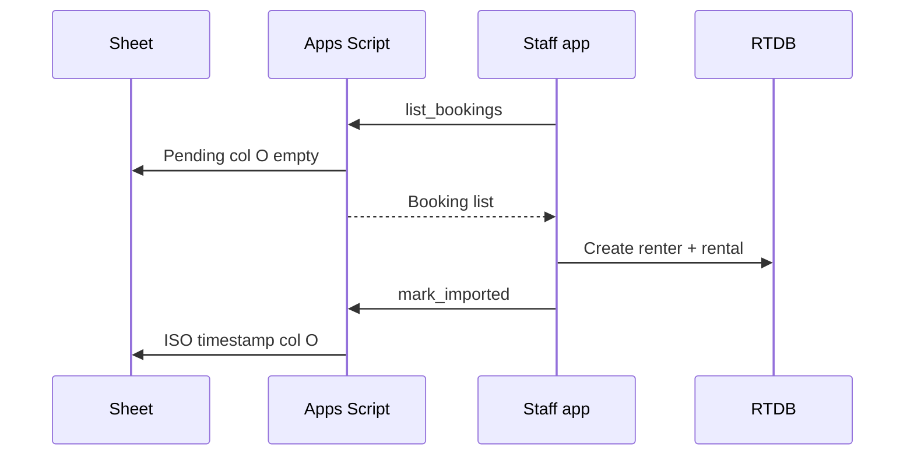

# Booking Platform Replication Guide (Technical)

**Purpose:** Self-contained technical reference for building and replicating a subscription-free facility booking platform. Architecture proven on Gold Standard Dog Training; Hub is the imported reference implementation.

**Marketing / overview / advertising LLM context:** [marshall-solutions-marketing-playbook.md](marshall-solutions-marketing-playbook.md)

**Reference client:** [Mohua Facility Hub (Hub)](https://example.com/)

**Last updated:** 2026-06-22

**Related ops docs:** [README.md](README.md) · [DEPLOYMENT.md](DEPLOYMENT.md) · [to-do.md](to-do.md)

**Origin:** Gold Standard Dog Training — read-only copy in `sourcefiles/` (do not deploy). Hub repo is the working template for new client forks.

---

## Table of contents

1. [How to use this guide](#1-how-to-use-this-guide)
2. [Architecture overview](#2-architecture-overview)
3. [Prerequisites checklist](#3-prerequisites-checklist)
4. [Phase A–F build walkthrough](#4-phase-af-build-walkthrough)
5. [GitHub secrets and environment variables](#5-github-secrets-and-environment-variables)
6. [Domain linking and DNS cutover](#6-domain-linking-and-dns-cutover)
7. [robots.txt, sitemap, and static prerender (SEO)](#7-robotstxt-sitemap-and-static-prerender-seo)
8. [Replication portability (next client)](#8-replication-portability-next-client)
9. [Deployment checklist](#9-deployment-checklist)
10. [Testing checklist](#10-testing-checklist)
11. [File manifest](#11-file-manifest)
12. [Sync matrix (three-place rule)](#12-sync-matrix-three-place-rule)
13. [Flexible duration design](#13-flexible-duration-design)
14. [API reference](#14-api-reference)
15. [Sheet schema and extended JSON](#15-sheet-schema-and-extended-json)
16. [Calendar setup and day-to-day ops](#16-calendar-setup-and-day-to-day-ops)
17. [Staff app (renters + payments)](#17-staff-app-renters--payments)
18. [Gold Standard → Hub substitution table](#18-gold-standard--hub-substitution-table)
19. [Troubleshooting](#19-troubleshooting)
20. [Appendix: example payloads](#20-appendix-example-payloads)
21. [Quick reference card](#21-quick-reference-card)

---

## 1. How to use this guide

### What this file gives you

- End-to-end architecture (public site → Apps Script → Sheets + Calendar → staff Firebase app)
- Step-by-step replication for new clients (Phase A–F)
- Hub-specific mappings (facilities, pricing, duration packages, renter CRM)
- Secrets, DNS, robots.txt, deployment and QA checklists
- API reference, sheet schema, troubleshooting

### Recommended build order

1. Google backend (Sheet + Calendar + Apps Script) — get `/exec` URL working
2. Public site — one facility, one duration, one test booking
3. Expand facilities, duration packages, marketing pages
4. Staff app (renter database + payment tracking)
5. Deploy, domain link, run QA checklist (§9–10)

### Out of scope for v1

- Online payment gateway (manual tracking in staff app)
- Multi-day date-range bookings (v2)
- Self-service weekly recurring bookings (staff calendar series + enquiry form)
- Allotment self-service booking (enquiry form only)

---

## 2. Architecture overview

### Why this stack

| Layer | Technology | Rationale | Typical ongoing cost |
|-------|------------|-----------|----------------------|
| Public site | React + Vite + TypeScript | Static build deploys anywhere | $0 (GitHub Pages / Netlify) |
| Backend | Google Apps Script | No server; native Sheets + Calendar | $0 (Google account) |
| Persistence | Google Sheet | Audit log, staff import queue | $0 (Workspace) |
| Availability | Google Calendar | Single source of truth | $0 (Workspace) |
| Staff app | Firebase Auth + RTDB | Private CRM | $0 (Firebase Spark) |
| CI/CD | GitHub Actions | Automated staff deploy | $0 (public repos) |

### Three-tier pattern



### Data flow for a confirmed booking



### Data ownership

| Data | Location | Account owner |
|------|----------|---------------|
| Bookings audit log | Google Sheet | Client Google Workspace |
| Calendar events | Google Calendar | Client Google Workspace |
| Enquiries | Same Sheet | Client Google Workspace |
| Renter CRM | Firebase RTDB | Client Firebase project |
| Website source | GitHub repo | Client or Marshall Solutions transfer |
| Admin secrets | Apps Script properties + GitHub Secrets | Client accounts |

### Security and robots model

**Public site — allow indexing + static HTML**

- [`index.html`](index.html): `meta robots index, follow`
- **Build-time prerender:** `npm run build:static` → Playwright writes per-route HTML into `dist/` (see [§7](#7-robotstxt-and-seo-strategy))
- `dist/sitemap.xml` and `dist/robots.txt` generated at build via `scripts/generate-seo-files.mjs`
- No admin secrets in public build

**Staff app — block all crawlers**

| Layer | Implementation |
|-------|----------------|
| `robots.txt` | [`staff-app/public/robots.txt`](staff-app/public/robots.txt) — `Disallow: /` |
| HTML meta | [`staff-app/index.html`](staff-app/index.html) — `noindex, nofollow` |
| HTTP headers | [`staff-app/firebase.json`](staff-app/firebase.json) — `X-Robots-Tag: noindex, nofollow` |

**Secrets model**

| Secret | Where stored | Never in |
|--------|--------------|----------|
| `TRAINER_IMPORT_KEY` | Apps Script script properties | Public site build |
| `VITE_BOOKING_IMPORT_KEY` | Staff app env / GitHub Secrets | Public site |
| `FIREBASE_SERVICE_ACCOUNT` | GitHub Secrets only | Client-side build |

### API transport (preserve exactly)

- **Method:** `POST`
- **Content-Type:** `text/plain;charset=utf-8` (avoids CORS preflight with Apps Script)
- **Body:** JSON string
- **Endpoint:** Apps Script Web app `/exec` URL

### Repository map (Hub)

| Path | Purpose |
|------|---------|
| [`src/`](src/) | Public React site |
| [`shared/`](shared/) | Booking contracts — sync with `Code.gs` |
| [`google-apps-script/Code.gs`](google-apps-script/Code.gs) | Backend API |
| [`staff-app/`](staff-app/) | Private Firebase staff CRM |
| [`sourcefiles/`](sourcefiles/) | Gold Standard reference — **do not deploy** |
| [`.github/workflows/staff-app.yml`](.github/workflows/staff-app.yml) | Staff CI → Firebase |
| [`marshall-solutions-marketing-playbook.md`](marshall-solutions-marketing-playbook.md) | Marketing / advertising LLM context |
| [`booking-platform-replication-guide.md`](booking-platform-replication-guide.md) | This file |
| [`to-do.md`](to-do.md) | Living go-live checklist |

**Pre-production fix:** [`staff-app/.firebaserc`](staff-app/.firebaserc) still points to `gsdt-trainer-private` — change to client project (e.g. `hub-staff`) before production deploy.

---

## 3. Prerequisites checklist

- [ ] Client Google account (Workspace or single account for Sheet + Calendar + Apps Script)
- [ ] Client domain registered
- [ ] GitHub repository
- [ ] Node.js 18+
- [ ] Firebase project for staff app
- [ ] Hub repo or `sourcefiles/` as template

| Resource | Owner | Notes |
|----------|-------|-------|
| Google Sheet | Client Google account | Bound to Apps Script |
| Google Calendar | Client | Dedicated booking calendar |
| Apps Script | Same account as Sheet | Execute as: Me |
| Firebase project | Client | New project per client |
| GitHub / hosting | Client or Marshall Solutions | Secrets in GitHub Actions |
| Domain DNS | Client registrar | CNAME or A to hosting |

---

## 4. Phase A–F build walkthrough

### Phase A — Google Cloud primitives

#### A1. Create the spreadsheet

1. Google Drive → New → Google Sheets → name e.g. `Hub Bookings`
2. Tab name: `Submissions`
3. Row 1 headers (A–Q):

```
Timestamp | Type | Name | Phone | Email | Organisation / Group | Facility Type | Add-ons | Message | Appointment Start | Appointment End | Calendar Event ID | Status | Facility | Staff Processed | Extended Details | Booking Category
```

See [§15](#15-sheet-schema-and-extended-json).

#### A2. Create the facility calendar

1. New calendar e.g. `Hub Facility Hire`
2. Copy **Calendar ID** (`@group.calendar.google.com`)
3. Share with Apps Script owner (Make changes to events)
4. Public visibility: **See all event details** (for embed)

**v1:** One calendar; prefix event titles (`MAKERSPACE —`, `KITCHEN —`).

#### A3. Bound Apps Script project

1. Spreadsheet → Extensions → Apps Script
2. Paste [`google-apps-script/Code.gs`](google-apps-script/Code.gs)
3. Update constants:

```javascript
const NOTIFY_EMAIL = "staff@example.com";
const CALENDAR_ID = "YOUR_CALENDAR_ID@group.calendar.google.com";
const SHEET_NAME = "Submissions";
const TIMEZONE = "Pacific/Auckland";
```

4. Update `BOOKING_TYPES`, `LOCATIONS`, `CATEGORIES` — [§12](#12-sync-matrix-three-place-rule)
5. Remove dog-training logic — [§18](#18-gold-standard--hub-substitution-table)

#### A4. Script property for staff app

Apps Script → Project Settings → Script properties → `TRAINER_IMPORT_KEY` (32+ chars). Same value → `VITE_BOOKING_IMPORT_KEY` in staff app only.

#### A5. Deploy Web app

Deploy → New deployment → Web app → Execute as: **Me** → Anyone → copy `/exec` URL.

```bash
curl "https://script.google.com/macros/s/YOUR_DEPLOYMENT_ID/exec"
```

**Critical:** Every `Code.gs` change requires **Deploy → New deployment**.

---

### Phase B — Public site

Hub repo contains the forked frontend. For a **new client**, fork Hub and:

1. Set `vite.config.ts` `base` (`/` for custom domain)
2. `.env.local`: `VITE_FORM_ENDPOINT`, `VITE_CALENDAR_ID`
3. Customize `bookingFacilities.ts`, pages, branding
4. Minimal routes: `/rentals/book`, `/contact`

Remove dog-training UI if forking from `sourcefiles/`.

---

### Phase C — Domain customization

**Hub wizard steps (v1):**

| Step | Content |
|------|---------|
| 1 | Pick facility |
| 2 | Pick duration (Hourly / Half day / Full day) |
| 3 | Pick date and start time |
| 4 | Renter details |
| 5 | Confirm + add-ons |

Apply [§12 sync matrix](#12-sync-matrix-three-place-rule) for every facility and duration.

---

### Phase D — Flexible duration model

See [§13](#13-flexible-duration-design). Each facility × duration = one `booking_type` key.

---

### Phase E — Staff app

See [§17](#17-staff-app-renters--payments). Hub [`staff-app/`](staff-app/) forked from Gold Standard.

Primary routes: `/imports/bookings`, `/renters`, `/renters/:renterId`

---

### Phase F — Deploy and verify

Smoke test: `availability` → `book` → sheet + calendar → staff import → public success message.

Full checklists: [§9](#9-deployment-checklist), [§10](#10-testing-checklist).

---

## 5. GitHub secrets and environment variables

### Never in public site build

| Secret | Where set | Must match |
|--------|-----------|------------|
| `TRAINER_IMPORT_KEY` | Apps Script script properties | `VITE_BOOKING_IMPORT_KEY` in staff app only |

### Apps Script (Google)

| Name | Where to set | Where to find |
|------|--------------|---------------|
| `TRAINER_IMPORT_KEY` | Script properties | `openssl rand -hex 32` |
| `CALENDAR_ID` | [`Code.gs`](google-apps-script/Code.gs) | Calendar → Integrate calendar |
| Spreadsheet binding | Automatic | Apps Script from Bookings sheet |

### Public site — `.env.local` or GitHub Actions

| Variable | Source |
|----------|--------|
| `VITE_FORM_ENDPOINT` | Apps Script `/exec` URL |
| `VITE_CALENDAR_ID` | Google Calendar ID |
| `VITE_SITE_URL` | Canonical origin for sitemap/robots (e.g. `https://example.com`) |

Template: [`.env.example`](.env.example)

### Staff app — `staff-app/.env.local` or GitHub Actions

| Variable | Source |
|----------|--------|
| `VITE_FIREBASE_API_KEY` | Firebase web app config |
| `VITE_FIREBASE_AUTH_DOMAIN` | Firebase web app config |
| `VITE_FIREBASE_DATABASE_URL` | Firebase web app config |
| `VITE_FIREBASE_PROJECT_ID` | e.g. `hub-staff` |
| `VITE_FIREBASE_STORAGE_BUCKET` | Firebase web app config |
| `VITE_FIREBASE_MESSAGING_SENDER_ID` | Firebase web app config |
| `VITE_FIREBASE_APP_ID` | Firebase web app config |
| `VITE_DEFAULT_TENANT_ID` | e.g. `hub` |
| `VITE_BOOKING_API_URL` | Same Apps Script `/exec` URL |
| `VITE_BOOKING_IMPORT_KEY` | Same as `TRAINER_IMPORT_KEY` |

Template: [`staff-app/.env.example`](staff-app/.env.example)

### GitHub Actions — staff app ([`.github/workflows/staff-app.yml`](.github/workflows/staff-app.yml))

| GitHub secret | Value source |
|---------------|--------------|
| `VITE_FIREBASE_API_KEY` | Firebase web app config |
| `VITE_FIREBASE_AUTH_DOMAIN` | Firebase web app config |
| `VITE_FIREBASE_DATABASE_URL` | Firebase web app config |
| `VITE_FIREBASE_PROJECT_ID` | Firebase web app config |
| `VITE_FIREBASE_STORAGE_BUCKET` | Firebase web app config |
| `VITE_FIREBASE_MESSAGING_SENDER_ID` | Firebase web app config |
| `VITE_FIREBASE_APP_ID` | Firebase web app config |
| `VITE_BOOKING_API_URL` | Apps Script `/exec` URL |
| `VITE_BOOKING_IMPORT_KEY` | Apps Script `TRAINER_IMPORT_KEY` |
| `FIREBASE_SERVICE_ACCOUNT` | Firebase service account JSON |

### GitHub Actions — public site ([`.github/workflows/public-site.yml`](.github/workflows/public-site.yml))

| GitHub secret | Value source |
|---------------|--------------|
| `VITE_FORM_ENDPOINT` | Apps Script `/exec` URL |
| `VITE_CALENDAR_ID` | Google Calendar ID |
| `VITE_SITE_URL` | Canonical site URL for sitemap/robots |

---

## 6. Domain linking and DNS cutover

1. Deploy `dist/` to staging (`*.github.io` or Netlify preview)
2. Full QA on staging
3. Configure DNS: GitHub Pages CNAME/A or Netlify equivalent
4. Add custom domain in hosting; enable HTTPS
5. `vite.config.ts` `base: '/'` for root domain

**Hub future:** Squarespace redirects, newsletter migration, full example.com cutover — see [`to-do.md`](to-do.md) §4.

---

## 7. robots.txt, sitemap, and static prerender (SEO)

### Why prerender (SSG)

The public site is a Vite + React Router SPA. A plain `vite build` ships one mostly empty `index.html` — crawlers see little content until JavaScript runs. For community/marketing sites on GitHub Pages, **post-build prerender** bakes each route to static HTML so Google gets titles, meta descriptions, and body copy immediately.

| Approach | This project |
|----------|----------------|
| Client-only SPA (`vite build`) | Dev and quick previews |
| **Post-build prerender (recommended)** | `npm run build:static` — production / CI |
| React Router v7 framework prerender | Not used — would require app restructure |
| Prerender.io (SaaS) | Not used — avoid another subscription |

### Build pipeline

```bash
npm run build:static
```

1. `tsc -b && vite build` — JS/CSS bundles
2. [`scripts/prerender.mjs`](scripts/prerender.mjs) — Playwright + `sirv` static server visits each route in [`scripts/prerender-routes.mjs`](scripts/prerender-routes.mjs); writes `dist/index.html` and `dist/<path>/index.html`
3. [`scripts/generate-seo-files.mjs`](scripts/generate-seo-files.mjs) — `dist/sitemap.xml` + `dist/robots.txt`
4. Copies `index.html` → `404.html` for GitHub Pages SPA fallback

**Env:** `VITE_SITE_URL` / `SITE_URL` (e.g. `https://example.com`) for canonical URLs, sitemap, and robots.

**CI:** [`.github/workflows/public-site.yml`](.github/workflows/public-site.yml) runs `build:static` and deploys `dist/` to GitHub Pages. Install step: `npx playwright install chromium --with-deps`.

**Keep routes in sync:** `scripts/prerender-routes.mjs` ↔ [`src/App.tsx`](src/App.tsx).

[`src/components/Seo.tsx`](src/components/Seo.tsx) sets `title`, `meta description`, and `link rel=canonical` during render so prerendered HTML includes SEO tags.

### Dual-site robots policy

| Surface | Policy | Implementation |
|---------|--------|----------------|
| Public marketing site | Allow indexing | Prerendered HTML + generated `robots.txt` / `sitemap.xml` in `dist/` |
| Staff CRM | Block all crawlers | `robots.txt Disallow: /` + noindex headers |

### Generated `robots.txt` (in dist/ at build)

```
User-agent: *
Allow: /

Sitemap: https://example.com/sitemap.xml
```

Replace domain via `VITE_SITE_URL` — do not commit a static `public/robots.txt` with the wrong host.

### Staff app (implemented)

[`staff-app/public/robots.txt`](staff-app/public/robots.txt): `Disallow: /` plus [`staff-app/firebase.json`](staff-app/firebase.json) and meta tags.

Do not link staff app URL from public site or sitemap.

---

## 8. Replication portability (next client)

| Changes per client | Reused from Hub template |
|--------------------|----------------------------|
| Branding, copy, images, routes | React + Vite scaffold |
| `BOOKING_TYPES`, facilities, pricing | Apps Script patterns |
| `NOTIFY_EMAIL`, address, timezone | Booking wizard flow |
| Domain, Google account | Staff import pipeline |
| Firebase tenant id | GitHub Actions workflow |
| Calendar name and ID | Three-place sync rule |

**Fork path:** Hub repo → new GitHub repo → customize → deploy to client accounts.

Substitution reference: [§18](#18-gold-standard--hub-substitution-table).

---

## 9. Deployment checklist

### Google Apps Script

- [ ] `NOTIFY_EMAIL` and `CALENDAR_ID` set
- [ ] `BOOKING_TYPES`, `LOCATIONS`, `CATEGORIES` match frontend
- [ ] `TRAINER_IMPORT_KEY` script property set
- [ ] Web app deployed; `/exec` tested
- [ ] New deployment after every `Code.gs` edit

### Public site

- [ ] `VITE_FORM_ENDPOINT`, `VITE_CALENDAR_ID`, and `VITE_SITE_URL` set
- [ ] `npm run test:booking` passes; `npm run build:static` succeeds
- [ ] `dist/` deployed (prerendered HTML per route + `sitemap.xml` + `robots.txt`)
- [ ] Booking page linked from rentals/marketing pages

### Staff app

- [ ] Firebase project created; `.firebaserc` updated
- [ ] GitHub Secrets configured
- [ ] `firebase deploy` — hosting + database rules
- [ ] Staff bootstrapped; import tested end-to-end
- [ ] Not linked from public site

### Security

- [ ] `TRAINER_IMPORT_KEY` only in staff app
- [ ] Staff app `noindex` + `robots.txt Disallow: /`
- [ ] Honeypot on all public forms

---

## 10. Testing checklist

### Pre-flight

- [ ] Live `/exec` URL; Sheet headers A–Q; col O = `Staff Processed`
- [ ] `TRAINER_IMPORT_KEY` matches staff app

### Manual tests

1. **Makerspace hourly** — `/rentals/book` → sheet `Booking`, calendar `MAKERSPACE — …`
2. **Kitchen half day + add-ons** — 4hr block, guest email, extended JSON flags
3. **Equipment + deposit** — `equipmentDeposit: true`, category `equipment`
4. **Staff import** — RTDB renter + rental; col O timestamp or `dismissed:…`
5. **Enquiry** — contact form → Type `Enquiry`

### Automated

```bash
npm install && npm run test:booking && npm run build
cd staff-app && npm install && npm run test:booking && npm run build
```

### Regression

- [ ] Concurrent book blocks slot
- [ ] Honeypot → fake success, no row
- [ ] Invalid `booking_type` rejected
- [ ] Blocked calendar time fails gracefully

---

## 11. File manifest

### Hub repo — booking core

| Path | Role |
|------|------|
| [`google-apps-script/Code.gs`](google-apps-script/Code.gs) | Backend API |
| [`shared/bookingFieldMap.ts`](shared/bookingFieldMap.ts) | Sheet schema |
| [`shared/bookingServiceTypes.ts`](shared/bookingServiceTypes.ts) | Booking types |
| [`shared/bookingCategories.ts`](shared/bookingCategories.ts) | Categories |
| [`src/pages/BookForm.tsx`](src/pages/BookForm.tsx) | Booking wizard |
| [`src/data/bookingFacilities.ts`](src/data/bookingFacilities.ts) | Facility list |
| [`staff-app/src/services/bookingImport.ts`](staff-app/src/services/bookingImport.ts) | Import client |
| [`.github/workflows/staff-app.yml`](.github/workflows/staff-app.yml) | CI deploy |

### Gold Standard origin (`sourcefiles/` — reference only)

| Source | Hub destination |
|--------|-------------------|
| `sourcefiles/google-apps-script/Code.gs` | `google-apps-script/Code.gs` |
| `sourcefiles/trainer-app/` | `staff-app/` |
| `sourcefiles/shared/` | `shared/` |

### Do not deploy

`sourcefiles/`, `node_modules/`, `staff-app/node_modules/`

---

## 12. Sync matrix (three-place rule)

Every bookable value must exist in **three places** and stay identical:

| # | Location | Content |
|---|----------|---------|
| 1 | `google-apps-script/Code.gs` | `BOOKING_TYPES`, `LOCATIONS`, `CATEGORIES` |
| 2 | `shared/bookingServiceTypes.ts` | Same `booking_type` IDs, durations, prices |
| 3 | `src/data/bookingFacilities.ts` + `bookingConfig.ts` | Facility IDs, labels |

### Hub facilities

| Facility ID | Label | Category |
|-------------|-------|----------|
| `makerspace` | The Makerspace | `facility` |
| `kitchen` | The Kitchen | `facility` |
| `earth-building` | Earth Building | `facility` |
| `equipment` | Fruit processing equipment | `equipment` |

Site address: `24 Waitapu Road, Tākaka 7110`

### Hub `BOOKING_TYPES`

| booking_type | sessionMinutes | calendarBlockMinutes | priceLabel |
|--------------|----------------|----------------------|------------|
| `makerspace_hourly` | 60 | 60 | $10 |
| `makerspace_half_day` | 240 | 240 | $35 |
| `makerspace_full_day` | 480 | 480 | $55 |
| `kitchen_hourly` | 60 | 60 | $12 |
| `kitchen_half_day` | 240 | 240 | $40 |
| `kitchen_full_day` | 480 | 480 | $70 |
| `earth_building_*` | 60/240/480 | 60/240/480 | TBD |
| `equipment_hourly` | 60 | 60 | $20 + $50 deposit |

Naming: `{facility}_{duration}`.

---

## 13. Flexible duration design

User picks duration **before** fetching slots. `getBookingDurations(bookingType)` drives slot length and calendar block.



**Slot grid:** 8:00 am – 6:00 pm, seven days. Hourly / half-day / full-day grid rules in `Code.gs`.

**v2:** custom `slot_end`, multi-day ranges, weekly recurring via enquiry only.

---

## 14. API reference

### Endpoint

```
POST https://script.google.com/macros/s/{DEPLOYMENT_ID}/exec
Content-Type: text/plain;charset=utf-8
```

### Actions

| action | Auth | Purpose |
|--------|------|---------|
| `enquiry` | Public | Contact / allotment enquiry (default) |
| `availability` | Public | Available start slots |
| `book` | Public | Confirm → calendar + sheet |
| `list_bookings` | `trainer_key` | Staff: pending (col O empty) |
| `mark_imported` | `trainer_key` | Staff: col O = ISO timestamp |
| `mark_dismissed` | `trainer_key` | Staff: col O = `dismissed:ISO` |

### Spam protection

Honeypot field `website` — if filled, fake success, no data written.

### `availability` request

| Field | Required | Description |
|-------|----------|-------------|
| `date` | Yes | `YYYY-MM-DD` |
| `booking_type` | Yes | e.g. `makerspace_hourly` |
| `location` | Yes | Must match `LOCATIONS` key |
| `category` | Yes | `facility` or `equipment` |

### `book` required fields

| Field | Required | Sheet column |
|-------|----------|--------------|
| `slot_start` | Yes | J |
| `booking_type` | Yes | extended JSON |
| `location` | Yes | N |
| `category` | Yes | Q |
| `phone` | Yes | D |
| `organisation` or `name` | Yes | C / F |
| `email` | No | E |

### Double-booking prevention

`LockService.getScriptLock()` in `handleBooking` — re-checks slot inside lock.

---

## 15. Sheet schema and extended JSON

### Columns A–Q

| Col | Header | Key | Content |
|-----|--------|-----|---------|
| A | Timestamp | `timestamp` | Row created |
| B | Type | `type` | `Enquiry` or `Booking` |
| C | Name | `name` | Contact name |
| D | Phone | `phone` | Required for booking |
| E | Email | `email` | Optional; calendar guest |
| F | Organisation / Group | `organisation` | Group name |
| G | Facility Type | `facilityType` | Optional |
| H | Add-ons | `addons` | Short text |
| I | Message | `message` | Notes |
| J | Appointment Start | `appointmentStart` | Slot start |
| K | Appointment End | `appointmentEnd` | Block end |
| L | Calendar Event ID | `calendarEventId` | From Calendar API |
| M | Status | `status` | `Confirmed` for bookings |
| N | Facility | `facility` | The Makerspace, etc. |
| O | Staff Processed | `staffProcessed` | Empty=pending; ISO=imported; `dismissed:ISO` |
| P | Extended Details | `extendedJson` | JSON schema v1 |
| Q | Booking Category | `category` | `facility` \| `equipment` |

### Extended JSON schema v1

```json
{
  "v": 1,
  "bookingType": "kitchen_half_day",
  "durationPackage": "half_day",
  "priceLabel": "$40",
  "firewood": false,
  "cleaningFeeAck": true,
  "equipmentDeposit": false,
  "depositAck": false,
  "addonNotes": "Need access to pizza oven"
}
```

Max 4000 chars (`EXTENDED_JSON_MAX` in Code.gs).

### Calendar event title format

```
MAKERSPACE — Jane Smith (Takaka Craft Group)
KITCHEN — John Doe
```

---

## 16. Calendar setup and day-to-day ops

1. Create facility-hire calendar → `CALENDAR_ID` in Code.gs + `VITE_CALENDAR_ID`
2. Share with staff; embed on public rentals/booking pages
3. **Block time:** calendar events → unavailable to wizard
4. **Manual bookings:** staff create events directly — no sheet row required
5. **Online bookings:** `book` creates event + sheet row + optional guest email

**v1:** One calendar; filter by title prefix.

---

## 17. Staff app (renters + payments)

### Entity mapping

| Gold Standard | Hub staff app |
|---------------|-----------------|
| Household | **Renter** |
| Dog | **Rental record** |
| Training session | **Facility hire** |
| Booking import | `/imports/bookings` |

### Key paths

| Component | Path |
|-----------|------|
| Booking API client | [`staff-app/src/services/bookingImport.ts`](staff-app/src/services/bookingImport.ts) |
| CI workflow | [`.github/workflows/staff-app.yml`](.github/workflows/staff-app.yml) |
| Tenant bootstrap | [`staff-app/scripts/tenant-bootstrap.example.json`](staff-app/scripts/tenant-bootstrap.example.json) |
| Database rules | [`staff-app/database.rules.json`](staff-app/database.rules.json) |

### RTDB schema (tenant `hub`)

```
tenants/hub/
  meta/
  members/{uid}/
  renters/{renterId}/
  rentals/{rentalId}/
  payments/{paymentId}/
```

### Import flow



### Payment tracking (v1 — manual)

No Stripe. Staff records `cash`, `bank`, `invoice`, `other` in `payments/`.

### Firebase setup

1. Create project (e.g. `hub-staff`) — update `.firebaserc`
2. Email/Password auth + Realtime Database
3. Deploy rules + hosting
4. Bootstrap tenant with staff UIDs
5. Configure GitHub Secrets

---

## 18. Gold Standard → Hub substitution table

| Gold Standard | Hub |
|---------------|-------|
| `standard_beach` / `elite_coaching` | `{facility}_{duration}` |
| Region | Category (`facility`, `equipment`) |
| Beach map | Facility card picker |
| `dog_name` | `organisation` or `name` |
| Dog fields, self-assessment | Remove |
| Commute / Nelson gating | Remove |
| `ELITE —` prefix | `MAKERSPACE —`, `KITCHEN —`, etc. |
| Trainer Imported (col O) | Staff Processed |
| Household / Dog | Renter / Rental |

### Code.gs — remove

`fitsCommuteForLocation()`, `isNelsonServiceDay()`, `NELSON_TITLE_PATTERN`, Nelson/commute branches.

### Code.gs — keep

`doPost()`, `handleAvailability()`, `handleBooking()`, `getAvailableSlots()`, `LockService` block, `appendSubmissionRow()`, `handleListBookings()`, `handleMarkImported()`, `handleMarkDismissed()`.

---

## 19. Troubleshooting

| Symptom | Likely cause | Fix |
|---------|--------------|-----|
| No sheet row | Wrong `SHEET_NAME`; script error | Apps Script Executions log |
| CORS error | Wrong Content-Type | `text/plain;charset=utf-8` |
| Empty availability | Wrong `CALENDAR_ID` or sharing | Verify ID + share with script owner |
| Book fails after slot shown | Stale availability | User picks another slot |
| Double booking | Lock timeout | Check Executions log |
| Staff import empty | Col O filled or wrong key | Match `TRAINER_IMPORT_KEY` |
| Code change not live | Saved not redeployed | Deploy → New deployment |
| Wrong Firebase project | Stale `.firebaserc` | Update to client project |

---

## 20. Appendix: example payloads

### Enquiry

```json
{
  "action": "enquiry",
  "name": "Sam Taylor",
  "phone": "027 999 8888",
  "email": "sam@example.com",
  "message": "Interested in allotment rental.",
  "website": ""
}
```

### Availability

```json
{
  "action": "availability",
  "date": "2026-08-01",
  "booking_type": "makerspace_full_day",
  "location": "The Makerspace",
  "category": "facility"
}
```

### Book

```json
{
  "action": "book",
  "booking_type": "kitchen_hourly",
  "location": "The Kitchen",
  "category": "facility",
  "slot_start": "2026-08-01T10:00:00",
  "name": "Maria Garcia",
  "phone": "021 234 5678",
  "email": "maria@communitykitchen.nz",
  "organisation": "Community Kitchen Collective",
  "message": "Bread baking workshop",
  "extended_json": "{\"v\":1,\"bookingType\":\"kitchen_hourly\",\"durationPackage\":\"hourly\",\"priceLabel\":\"$12\",\"cleaningFeeAck\":true}"
}
```

### Staff list_bookings

```json
{
  "action": "list_bookings",
  "trainer_key": "your-secret-key-here"
}
```

### Confirmation email template

```
Subject: Hub booking confirmed — The Kitchen

Kia ora {name},

Your facility hire at the Mohua Facility Hub is confirmed.

Facility:     The Kitchen
Package:      Hourly ($12)
Date & time:  {slotLabel}
Address:      24 Waitapu Road, Tākaka 7110

Payment is due as arranged with Hub staff. This booking does not process payment online.

Questions? staff@example.com

Ngā mihi,
Mohua Facility Hub
```

---

## 21. Quick reference card

```
┌──────────────────────────────────────────────────────────────────┐
│  BOOKING PLATFORM — TECHNICAL QUICK REFERENCE                    │
├──────────────────────────────────────────────────────────────────┤
│  Stack:    React site → Apps Script → Sheet + Calendar             │
│            Staff app → Firebase RTDB                             │
│                                                                  │
│  Setup:    1. Sheet (A–Q)  2. Calendar  3. Code.gs → /exec URL    │
│            4. Public env   5. Staff app + GitHub Secrets         │
│            6. Domain DNS  7. robots.txt (public allow, staff no) │
│                                                                  │
│  Sync:     Code.gs ↔ shared/bookingServiceTypes ↔ bookingFacilities│
│                                                                  │
│  Marketing: marshall-solutions-marketing-playbook.md             │
│  Hub:     Code complete; go-live pending                       │
│  v1:        facility × duration, single calendar, manual payments│
│  Security:  Admin key never in public build; staff app noindex   │
└──────────────────────────────────────────────────────────────────┘
```

---

*Technical replication guide. Marketing context: [marshall-solutions-marketing-playbook.md](marshall-solutions-marketing-playbook.md). Ops checklist: [to-do.md](to-do.md).*
